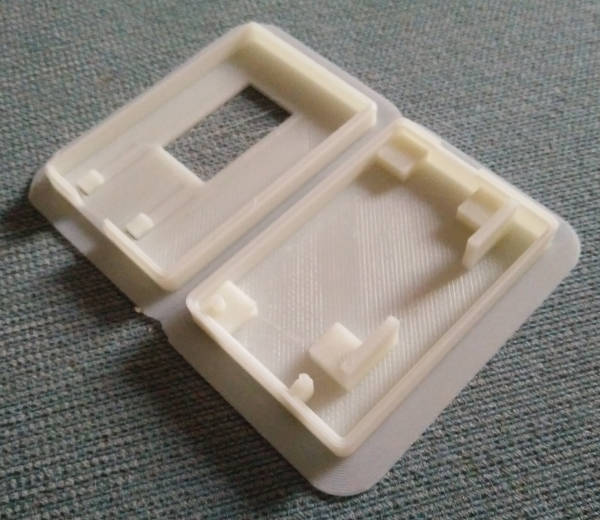

ESP32 LORA OLED board case
==========================

This is a simple case for the ESP32 LORA OLED board and antenna.

It was drawn up in Fusion 360 based on the [Fusion 360 Snap Fit Cases | 3D-Printable Raspberry Pi Case](https://www.youtube.com/watch?v=E0NVC8xhf3I) YouTube tutorial; and using the ESP32 LORA board model from [ESP32 Lora OLED GrabCAD model](https://grabcad.com/library/esp32-lora-oled-1) (extracted copy in ESP32LoraOled_Board).

It is by no means perfect, but does the job.

See also https://www.thingiverse.com/thing:4460498

